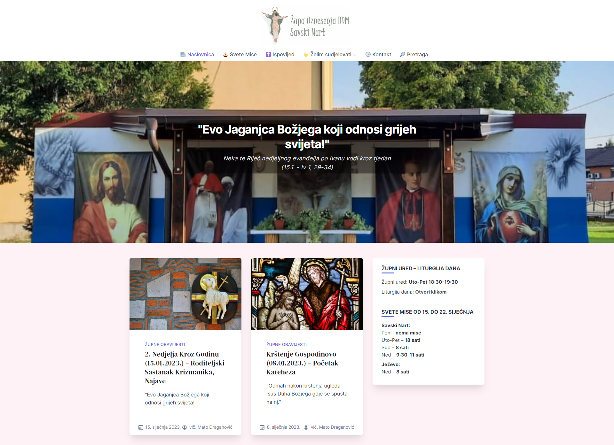

Hello, I’m @shtef21!

I am...
- 👨‍🎓 a student of [Zagreb University of Technology](https://www.tvz.hr/)
- 💻 a back-end developer mainly working on ASP .NET
- 📫 a [Medium](https://medium.com/@shtef21) writer
- 🏭 co-creator of [hiza.js](https://github.com/nevenpalcec/hiza_js) library
- 🛵 the creator of [hiza.engine](https://app.my-rents.com/web/hiza-tutorial.html) templating engine

You may reach me on [LinkedIn](https://www.linkedin.com/in/stjepan-salopek-5a68a8256/),
or check out my [personal site](https://ssalopek.me/)

### Stats

## Projects

You may check out my personal project in the repositories. Aside from those projects, there is also...

### Local parish website

I've created and have been running a local parish website since 2020. Check it out: [www.zupa-ubdm-nart-savski.hr](https://www.zupa-ubdm-nart-savski.hr)

### Time keeper

I've collaborated with
[Marin](https://github.com/marinjurisich),
[Luka](https://github.com/LukaSpoljar) and
[Ivan](https://github.com/marinjurisich)
on a project management / clock-in app called time keeper.

[Check it out...](https://github.com/marinjurisich/timekeeper)

<!-- - 💞️ I’m looking to collaborate on ... -->

<!---
shtef21/shtef21 is a ✨ special ✨ repository because its `README.md` (this file) appears on your GitHub profile.
You can click the Preview link to take a look at your changes.
--->
