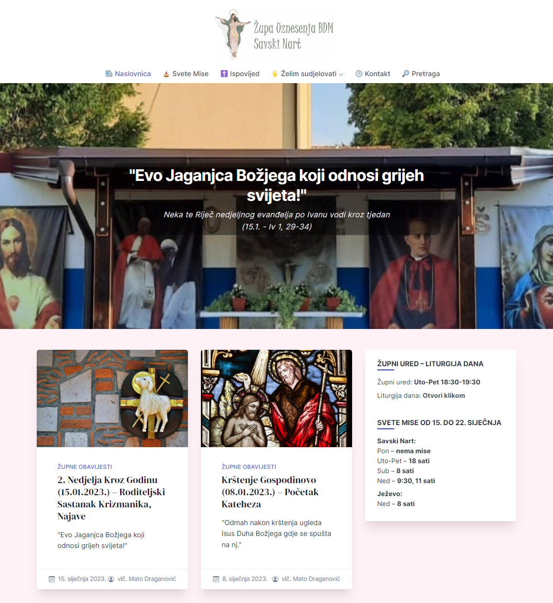

Hello, I’m @shtef21!

I am...
- 👨‍🎓 a student of [Zagreb University of Technology](https://www.tvz.hr/)
- 💻 a software developer working for [Ericsson Nikola Tesla](https://www.ericsson.hr/)
- 📫 a [Medium](https://medium.com/@shtef21) writer
- 🏭 co-creator of [hiza.js](https://github.com/nevenpalcec/hiza_js) library
- 🛵 the creator of [hiza.engine](https://app.my-rents.com/web/hiza-tutorial.html) templating engine

You may reach me on [LinkedIn](https://www.linkedin.com/in/stjepan-salopek-5a68a8256/),
or check out my [personal site](https://shtef21.github.io/).

# Projects

You may check out my personal projects in. Some notable work includes...

### Solving mazes using the A* search algorithm ([🔗 link](https://github.com/shtef21/py_maze_demo))

As part of a college course, I researched solving mazes using the A* algorithm.

The linked repository contains the source code, research paper, and presentation.
I created and presented both the paper and the presentation to a Croatian audience.

### Time keeper ([🔗 link](https://github.com/marinjurisich/timekeeper))

I've collaborated with
[Marin](https://github.com/marinjurisich),
[Luka](https://github.com/LukaSpoljar) and
[Ivan](https://github.com/marinjurisich)
on a project management / clock-in app called time keeper.

### CoffeeMS ([🔗 link](https://github.com/shtef21/CoffeeMS))

I've collaborated with
[Marin](https://github.com/marinjurisich)
on a coffee place CMS app called CoffeeMS.

<!-- - 💞️ I’m looking to collaborate on ... -->

<!---
shtef21/shtef21 is a ✨ special ✨ repository because its `README.md` (this file) appears on your GitHub profile.
You can click the Preview link to take a look at your changes.
--->

### A introductory paper on Video editing (mostly Croatian)

Repo containg code and Word document: [py_video_demo](https://github.com/shtef21/py_video_demo)

YouTube video: [Obrada videozapisa u Python programskom jeziku](https://www.youtube.com/watch?v=7vmLFBI3AIw)

## Local parish website ([🔗 link](https://www.zupa-ubdm-nart-savski.hr))

Aside from that, I've created and have been maintaining a local parish website since 2020.

